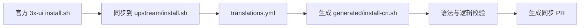

# 3x-ui 中文安装器

[](https://github.com/V2RaySSR/3x-ui-cn-installer/actions/workflows/sync.yml)

自动同步官方 [3x-ui](https://github.com/MHSanaei/3x-ui) 安装脚本，并生成中文本地化安装脚本。

本项目只做一件事：

> 保持官方安装逻辑不变，仅汉化安装过程中的交互提示、菜单文字和状态文字。

## 一键安装

```bash
bash <(curl -Ls https://raw.githubusercontent.com/V2RaySSR/3x-ui-cn-installer/main/generated/install-cn.sh)
```

## 设计目标

- 面向中文用户，降低安装和证书配置过程中的理解成本
- 跟随官方安装脚本更新，不维护独立分叉逻辑
- 只翻译用户可见输出，不改安装流程和系统操作
- 通过自动化校验拦截危险变更，避免发布半坏脚本
- PR 中自动给出同步校验报告，便于审查后再合并

## 工作流



## 自动校验

每次同步都会执行以下检查：

- `bash -n` 检查官方脚本和中文脚本语法
- 对比官方脚本，确认非输出逻辑行完全一致
- 检查 Bash 变量中是否被误插入中文
- 检查命令菜单边框显示宽度，避免中文导致表格错位
- 扫描明显未翻译的用户可见英文文案
- 确认生成过程可重复

如果核心逻辑存在意外变化，自动流程会失败，不会生成可合并的同步结果。

## 汉化范围

已覆盖：

- 安装过程提示
- SSL 证书配置提示
- 错误提示
- 安装完成信息
- 常用命令菜单

不汉化、不修改：

- 变量名
- 函数名
- 下载地址
- 系统服务配置
- 安装逻辑
- 官方项目名称和命令名称

## 文件说明

- `generated/install-cn.sh`：中文安装脚本，用户直接执行这个文件
- `upstream/install.sh`：同步自官方的原始安装脚本
- `translations.yml`：中文翻译映射表
- `scripts/translate.py`：中文脚本生成器，包含中文菜单宽度排版逻辑
- `scripts/validate.py`：生成结果验证器
- `.github/workflows/sync.yml`：自动同步和 PR 工作流

## 自动更新

仓库每天自动检查官方安装脚本。

如果官方脚本发生变化，GitHub Actions 会自动：

1. 同步官方最新版 `install.sh`
2. 重新生成 `generated/install-cn.sh`
3. 执行发布前校验
4. 创建同步 PR，并在 PR 正文写入校验报告

PR 合并后，用户使用的一键安装命令就会自动指向最新版中文脚本。

## 维护原则

中文脚本由自动流程生成，不直接手工编辑 `generated/install-cn.sh`。

如果官方脚本新增英文提示，应更新 `translations.yml`，再由自动流程重新生成中文脚本。
